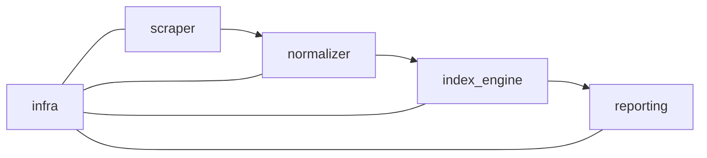

# ARCHITECTURE.md — Arquitectura del sistema

La aplicación se organiza en cinco capas principales. Cada una se puede
adaptar o reemplazar sin afectar el resto si se respetan las interfaces.

## Diagrama de flujo

## Módulos

### `scraper`
- **Rol:** obtener precios brutos desde La Anónima Online.
- **Entradas:** configuraciones de búsqueda y rutas de categoría.
- **Salidas:** JSON con productos, precios y metadatos.
- **Extender:** implementar adaptadores para nuevos orígenes manteniendo
  un contrato de salida uniforme.

### `normalizer`
- **Rol:** estandarizar unidades, promociones y descripciones.
- **Entradas:** datos del `scraper`.
- **Salidas:** registros normalizados listos para cálculo.
- **Extender:** agregar reglas en `normalize/` o nuevos pipelines
  documentando supuestos de conversión.

### `index_engine`
- **Rol:** calcular costos de CBA e índices a partir de los registros
  normalizados.
- **Entradas:** dataset normalizado y parámetros de canasta.
- **Salidas:** series temporales de costos e índices.
- **Extender:** permitir nuevos esquemas de ponderación o bases mediante
  funciones puras y pruebas de regresión.

### `reporting`
- **Rol:** generar tablas, gráficos y narrativas para difusión.
- **Entradas:** resultados de `index_engine`.
- **Salidas:** informes reproducibles en formatos abiertos.
- **Extender:** sumar plantillas o conectores (API, CSV, HTML) sin
  acoplarse a librerías específicas.

### `infra`
- **Rol:** utilidades transversales de configuración, logging y
  resiliencia.
- **Entradas/Salidas:** servicios compartidos para los demás módulos.
- **Extender:** centralizar retrys, métricas y variables de entorno para
  facilitar despliegues en diferentes contextos.

## Recomendaciones generales
- Mantener contratos explícitos entre capas.
- Versionar los insumos y decisiones metodológicas.
- Evitar dependencias circulares; `infra` debe permanecer liviano.
